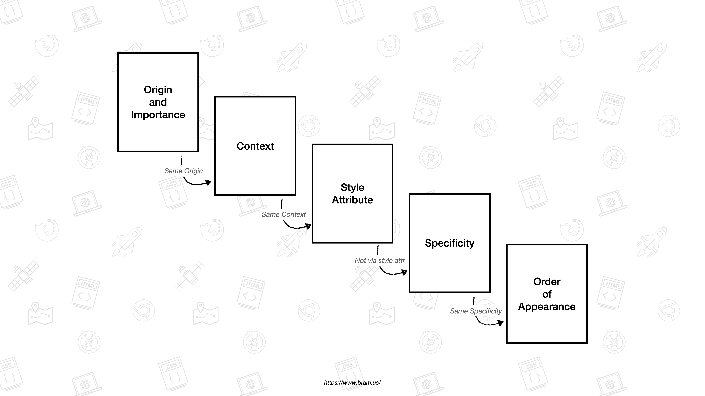
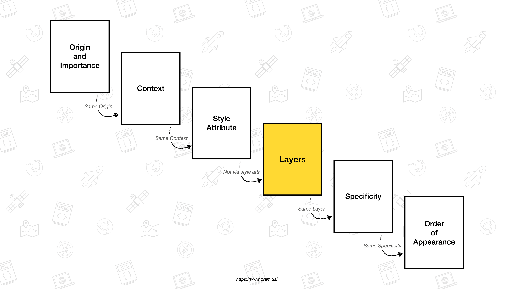
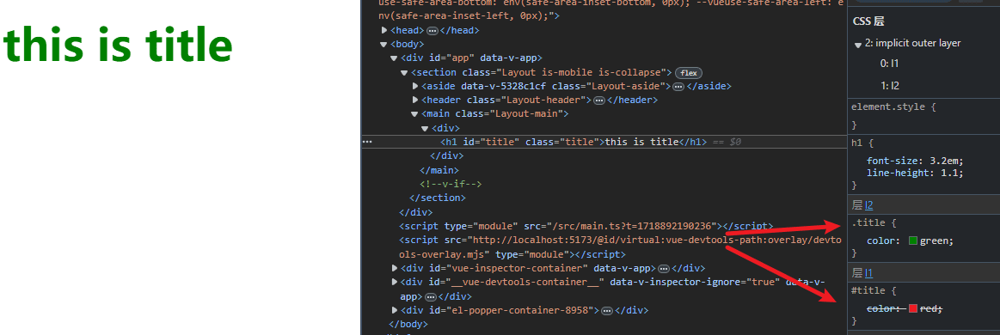
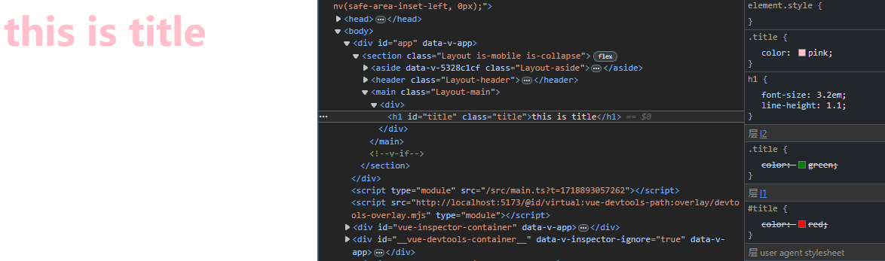
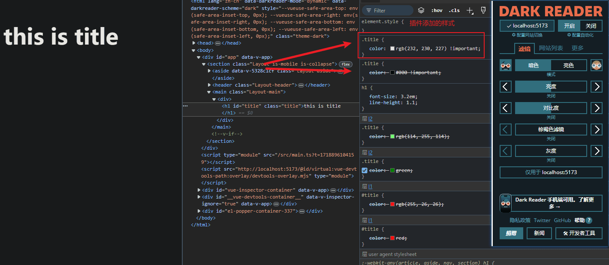

# CSS-@layer 探索

最近在看一些国外文章，总是能看到 `@layer` 这个属性，因此在这里记录一下。

::: info 参考
[The Future of CSS: Cascade Layers (CSS @layer)](https://www.bram.us/2021/09/15/the-future-of-css-cascade-layers-css-at-layer/)

[MDN - CSS 层叠](https://developer.mozilla.org/zh-CN/docs/Web/CSS/Cascade)

[MDN - @layer](https://developer.mozilla.org/zh-CN/docs/Web/CSS/@layer)
:::

## 摘要

[MDN](https://developer.mozilla.org/zh-CN/docs/Web/CSS/@layer) 对 `@layer` 的描述是:

> CSS @规则 中的@layer 声明了一个 级联层，同一层内的规则将级联在一起，这给予了开发者对层叠机制的更多控制。

```css
@layer utilities {
  /* 创建一个名为 utilities 的级联层 */
}
```

所谓的级联层，就是 CSS 的 3 大特性之一的 **层叠** 特性。

## 层叠顺序

CSS 层叠有一套层叠算法用来决定每个文档元素应该应用哪个样式值，在没有引入 `@layer` 之前，其层叠的计算顺序如下：



1. `Origin and Importance - (样式表来源和 !important 声明)`
2. `Context -（上下文，如 CSS 继承）`
3. `Style Attribute -（Style 样式）`
4. `Specificity -（选择器的特异性）`
5. `Order of Appearance - (编码的顺序)`

上述标准的优先级从高到低，然后层叠算法会根据上述的顺序对定义的 CSS 样式进行一一比对，最后决定哪个 CSS 样式属性胜出并应用到 DOM 上。

当应用 `@layer` 规则后，则会插入一个 `Layers`，如下图所示：



可以看到 `@layer` 生成的层叠 `Layers` 的优先级比选择器的特异性 - `Specificity` 要高，这一点很重要，下面的示例将会进行说明。

## 使用

### Layer 创建

层叠 Layer 可以通过以下几种方式进行创建：

```css
/* 1、只声明，不分配样式 */
@layer reset;

/* 2、声明，并立即分配样式 */
@layer reset {
  h1 {
    margin: 0;
  }
}

/* 3、为 @import 引入的样式表创建一个 layer */
@import url(reset.css) layer(reset);

/* 4、创建一个匿名 layer，因为无法引用，所以只能在创建的时候分配样式， */
@layer {
  h1 {
    margin: 0;
  }
}

/* 4、创建一个嵌套 layer，后续可通过嵌套形式或 @layer reset.nested 引用 */
@layer reset {
  @layer nested {
  }
}
```

### Layer 顺序

层叠 Layer 的优先级根据其首次声明的顺序决定，即：声明越后，优先级越高。

```css
@layer reset {
  /* Create 1st layer named “reset” */
}

@layer base {
  /* Create 2nd layer named “base” */
}

@layer theme {
  /* Create 3rd layer named “theme” */
}

@layer reset {
  /* reset 在之前已经声明过了，此处再次应用 @layer 只会合并样式 */
}
```

上面创建的 `Layer` 优先级是依次递增的，`theme` 内部声明的样式将会覆盖 `reset` 和 `base` 的冲突样式。

并且，多次使用 `@layer` 规则并不会改变其优先级，后续的声明只是合并样式，其优先级只跟第一次声明的顺序位置有关，因此，可以有更便捷的创建方式：

```css
/* 推荐使用这种方式：先声明顺序，再补充样式 */
@layer reset, base, theme;

@layer reset {
  /* 补充样式 */
}

@layer theme {
  /* 补充样式 */
}
```

### 示例

层叠 `Layer` 有什么特性呢，下面通过 1 个示例来看看。

首先我们创建一个 `h1` 标签，然后通过 `@layer` 来对其应用不同的样式。

```html
<h1 id="title" class="title">this is title</h1>
```

```css
@layer l1, l2;

@layer l2 {
  .title {
    color: green;
  }
}

@layer l1 {
  #title {
    color: red;
  }
}
```



在 CSS 中，`l1` 的样式声明在后，并且它的特异性`(1,0,0)`也比 `l2(0,1,0)` 的高，但是由于在 `@layer` 声明的时候，`l2` 在后，因此 `l2` 内的样式具有更高的优先级，所以最后 `title` 的颜色为 `green`。

然后，我们再加一行代码：

```css{3-5}
@layer l1, l2;

.title {
  color: pink;
}

@layer l2 {
  .title {
    color: green;
  }
}

@layer l1 {
  #title {
    color: red;
  }
}
```



嗯？`title` 的颜色变为了 `pink`，是什么原因呢？其实，在这里有一个细节：未通过 `@layer` 规则声明的样式，会隐式创建一个 `Layer`，然后添加到层叠顺序的末尾，上述代码实际创建了如下的 `Layer Order`：

1. `l1`
2. `l2`
3. `unlayered styles` (即上述 CSS 的新增部分)

因此，隐式创建的 `Layer` 将会获得最大优先级。

### 小结

通过上述例子，我们可以得出：

> **浏览器为 DOM 匹配 CSS 样式的时候，层叠算法是先于选择器优先级算法的**。

这一结论在上文的 `层叠顺序` 部分展示的图片已经清楚的表明了。

## 层叠的来源

在前面层叠顺序部分，层叠算法比对的首先就是来源，一个网页的 CSS 样式表来源有很多，如用户代理，用户，页面作者等，对于层叠的来源具体展开有以下 8 种，并且优先级也是从低到高排序的：

1. `Normal User-Agent - 用户代理`
2. `Normal User - 用户`
3. `Normal Author - 作者`
4. `Animations - 动画效果`
5. `Important Author - 作者`
6. `Important User - 用户`
7. `Important User-Agent - 用户代理`
8. `Transitions - 过渡样式`

其中，`用户代理` 指的就是浏览器自带的一些标签样式，`用户` 一般是一些浏览器插件作用的样式，而 `作者` 就是指网页开发人员编写的样式表，带有 `Important` 前缀表明相关的样式应用了 `!important` 规则。

可以看到，我们开发者编写的样式表属于 `Normal Author`，比浏览器的用户代理和插件的样式表优先级要高，同时如果应用了动画和过渡效果，则优先级还会提高。

## 层叠与!important

当一个 CSS 样式声明被 `!important` 标记后，它在层叠顺序中的权重就会增加，并且会反转优先顺序。

让我们来修改一下前文的 title 例子：

```css
@layer l1, l2;

@layer l2 {
  .title {
    color: green !important;
  }
}

@layer l1 {
  #title {
    color: red !important;
  }
}
```

这时候 `l1 layer` 和 `l2 layer` 的优先级将被反转，最后 `title` 渲染的颜色变成了 `red`。

下面是一个更直观的例子：



在上图中，我开启了一个暗黑阅读的浏览器插件，导致 `title` 的样式有如下匹配：

```css
/* 插件提供的 - Important User */
.title {
  color: rgb(232, 230, 227) !important;
}

/* 作者提供的 - Important Author */
.title {
  color: #000 !important;
}
```

由于两者都应用了 `!important`，因此层叠顺序由 `Normal User/Normal Author` 反转成了 `Important Author/Important User`，插件的样式表获得了比我的样式表更高的优先级，才得以让这个插件能够作用，若是这个插件不使用 `!important` 规则，那么它将无法覆盖我的样式，因为它处于 `Normal User` 位置。

关于层叠更多的使用细节，可以阅读这篇[文章](https://www.bram.us/2021/09/15/the-future-of-css-cascade-layers-css-at-layer/)，这里就不继续展开了。

## 结语

通过探究 `@layer`，对浏览器关于 `CSS` 匹配计算的工作流程有了更清晰的了解，其中最重要的就是：

> 层叠的计算是优先于选择器优先级的。

而层叠计算的精髓则在层叠顺序的两张图中已经表明的非常清楚了。

最后想说的是，关于 `@layer` 的落地使用。个人认为在一些样式重构上可以尝试使用，比如将旧的样式统一放在一个较低的 `Layer` 中，然后再创建一个更高的 `Layer`，将新样式的声明放入其中，`Layer` 带来的便利就是：不再需要考虑旧样式选择器的优先级和代码顺序，因为新的 `Layer` 已经在层叠计算中胜出了，这样可以非常快速的覆盖旧样式。但是话又说回来，现在的 UI 框架都是按需引入样式，很难对其通过一个 `Layer` 进行管理，具体的应用看来还是有待实践。
