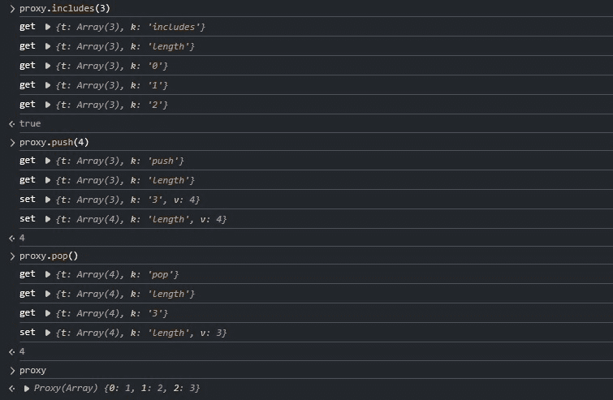

# Vue 响应式系统 - BaseHandlers

在 `reactive.ts` 模块中从 `baseHandlers.ts` 模块导入了 4 个 `ProxyHandler` 类，这 4 个类分别对应了 `reactive、readonly、shallowReactive、shallowReadonly` 4 个响应式函数的 `handler` 参数。

```ts
// reactive.ts
import {
  mutableHandlers,
  readonlyHandlers,
  shallowReactiveHandlers,
  shallowReadonlyHandlers
} from './baseHandlers'

// baseHandlers.ts
export const mutableHandlers = new MutableReactiveHandler()
export const readonlyHandlers = new ReadonlyReactiveHandler()
export const shallowReactiveHandlers = new MutableReactiveHandler(true)
export const shallowReadonlyHandlers = new ReadonlyReactiveHandler(true)

class BaseReactiveHandler implements ProxyHandler<Target> {
  constructor(
    protected readonly _isReadonly = false,
    protected readonly _isShallow = false
  ) {}
  // ...
}

class MutableReactiveHandler extends BaseReactiveHandler {
  constructor(isShallow = false) {
    super(false, isShallow)
  }
  // ...
}

class ReadonlyReactiveHandler extends BaseReactiveHandler {
  constructor(isShallow = false) {
    super(true, isShallow)
  }
  // ...
}
```

`baseHandlers.ts` 模块的核心逻辑就是上述代码中的 3 个 `ProxyHandler` 类：

> **_BaseReactiveHandler、MutableReactiveHandler、ReadonlyReactiveHandler_**

::: tip
在 **_get_** 和 **_set_** 代理的逻辑中存在一个 `receiver` 对象，关于这个对象的知识可以参考这篇文章：[Receiver](../../blogs/js-receiver)
:::

## BaseReactiveHandler

`BaseReactiveHandler` 只代理了 **_get_** 方法，其源码如下：

### proxy.get

```ts
class BaseReactiveHandler implements ProxyHandler<Target> {
  constructor(
    protected readonly _isReadonly = false,
    protected readonly _isShallow = false
  ) {}

  get(target: Target, key: string | symbol, receiver: object) {
    const isReadonly = this._isReadonly,
      isShallow = this._isShallow

    // ✨拦截 ReactiveFlags 枚举的成员访问
    // ✨分别对应 isReactive, isReadonly, isShallow, toRaw 4个响应式工具
    // ✨同时可以看到，其结果并不依赖某个成员是否在目标对象上，而是通过闭包的方式，存储在构造类的作用域中
    if (key === ReactiveFlags.IS_REACTIVE) {
      return !isReadonly
    } else if (key === ReactiveFlags.IS_READONLY) {
      return isReadonly
    } else if (key === ReactiveFlags.IS_SHALLOW) {
      return isShallow
    } else if (key === ReactiveFlags.RAW) {
      if (
        receiver ===
          (isReadonly
            ? isShallow
              ? shallowReadonlyMap
              : readonlyMap
            : isShallow
              ? shallowReactiveMap
              : reactiveMap
          ).get(target) ||
        // receiver is not the reactive proxy, but has the same prototype
        // this means the reciever is a user proxy of the reactive proxy
        Object.getPrototypeOf(target) === Object.getPrototypeOf(receiver)
      ) {
        /**
         * ✨条件1成立：当前操作的receiver是vue已经生成并保存在对应map中的代理对象
         * ✨条件2成立：对vue的响应式代理对象又进行了自定义代理
         * @example 条件2
         * const raw = {}
           const vueProxy = reactive(raw)
           const userProxy = new Proxy(vueProxy, {})
           console.log(toRaw(userProxy) === raw) // true
           这里有一个隐藏条件，就是 userProxy 没有拦截 getPrototypeOf 操作
         */
        return target
      }
      // early return undefined
      return
    }

    const targetIsArray = isArray(target)

    if (!isReadonly) {
      // ✨返回重载后的部分数组方法和hasOwnProperty方法
      if (targetIsArray && hasOwn(arrayInstrumentations, key)) {
        return Reflect.get(arrayInstrumentations, key, receiver)
      }
      if (key === 'hasOwnProperty') {
        return hasOwnProperty
      }
    }

    const res = Reflect.get(target, key, receiver)

    // ✨内置Symbol和不追踪的key跳过track
    if (isSymbol(key) ? builtInSymbols.has(key) : isNonTrackableKeys(key)) {
      return res
    }

    // ✨只读跳过track，因为无法修改属性值，也就无法通知订阅者更新，所以没必要track
    if (!isReadonly) {
      track(target, TrackOpTypes.GET, key)
    }

    // ✨shallow模式，跳过深层代理，对于对象根属性的响应性追踪已经在上一行代码触发了
    if (isShallow) {
      return res
    }

    /**
     * ✨自动解包target中的ref属性，如果访问数组索引则跳过，并且shallow模式也没有自动解包的行为
     * 详情见：vue文档-对于额外的 ref 解包细节
     * {@link https://cn.vuejs.org/guide/essentials/reactivity-fundamentals.html#additional-ref-unwrapping-details}
     */
    if (isRef(res)) {
      // ref unwrapping - skip unwrap for Array + integer key.
      return targetIsArray && isIntegerKey(key) ? res : res.value
    }

    // ✨递归调用转换，因此reactive是深层的，同时也是惰性执行的
    // ✨对于 惰性执行 是这样理解的：
    // ✨一个对象的属性如果没有被访问，就不会触发其本身以及子属性的get代理，只有通过get访问才会进行响应性代理，所以是lazy的
    // ✨可以看出，虽然reactive默认是进行深层转换的，但这个操作只针对需要访问的属性，提高了初始化的效率，这点与vue2是不同的
    if (isObject(res)) {
      // Convert returned value into a proxy as well. we do the isObject check
      // here to avoid invalid value warning. Also need to lazy access readonly
      // and reactive here to avoid circular dependency.
      return isReadonly ? readonly(res) : reactive(res)
    }

    return res
  }
}
```

`get` 代理的逻辑较为简单，首先是处理了之前提到的 `ReactiveFlags` 枚举成员的拦截，接着是对部分数组方法和 `hasOwnProperty` 方法的拦截，详情见下文，然后进行 track，`ref` 的自动解包，最后进行递归的响应式转换。

需要特别说明的是关于 `toRaw` 工具返回代理的原始对象的这个条件：

> `Object.getPrototypeOf(target) === Object.getPrototypeOf(receiver)`

作者的注释指出这一条件成立的情况就是用户对 vue 的响应式对象添加了自己的代理操作。如果将用户代理对象传入 `toRaw` 方法，那么当执行到 `get` 代理时，内部的 `target` 指向了 vue 的响应式对象，`receiver` 指向了用户创建的 proxy 实例，而 `but has the same prototype` 说的是两者都属于 proxy 类的实例，从而两者的原型对象也一致，因此条件成立。如果用户定义了 `getPrototypeOf` 代理而改变了原型对象的返回，那么条件就不一定成立。

::: info get 特性

对 vue 的 `reactive` 代理对象进行 `get` 访问，如果访问的属性是一个普通对象，那么将返回这个对象的 `reactive` 版本，即 `reactive` 的深层代理特性。

```ts
const v = {}
const target = {
  raw: v,
  reactive: reactive(v)
}
const proxy = reactive(target)
console.log(proxy.raw === v) // false
console.log(proxy.raw === proxy.reactive) // true
// ✨原因在于 get 代理最后的代码进行了 reactive 递归转换，因此 proxy.raw 等价于 reactive(v)
// ✨或者说当访问 proxy.reactive 的时候，实际背后的执行的是 reactive(reactive(v))
// ✨同时对于每个原始对象的代理版本会缓存在相应的 map 中，因此反复转换也只会返回同一个代理对象
```

:::

## MutableReactiveHandler

`MutableReactiveHandler` 的核心是代理了 **_set_** 方法，同时还有 **has, deleteProperty, ownKeys** 方法，其 **set** 代理的源码如下：

### Proxy.set

```ts
class MutableReactiveHandler extends BaseReactiveHandler {
  constructor(isShallow = false) {
    super(false, isShallow)
  }

  set(
    target: object,
    key: string | symbol,
    value: unknown,
    receiver: object
  ): boolean {
    let oldValue = (target as any)[key]
    if (!this._isShallow) {
      const isOldValueReadonly = isReadonly(oldValue)
      if (!isShallow(value) && !isReadonly(value)) {
        // ✨如果赋值的value是shallow或readonly的，不能进行toRaw转换，保留其原本的特性
        // ✨进行toRaw转换是为了处理多次reactive的情况，减少trigger次数
        oldValue = toRaw(oldValue)
        value = toRaw(value)
      }
      // ✨对ref属性进行自动解包赋值，如果赋值的新属性不是ref或者本体是只读代理则跳过赋值
      if (!isArray(target) && isRef(oldValue) && !isRef(value)) {
        if (isOldValueReadonly) {
          return false
        } else {
          oldValue.value = value
          return true
        }
      }
    } else {
      // in shallow mode, objects are set as-is regardless of reactive or not
      // ✨shallow mode只观察对象的根属性是否变动，并不关心根属性变动前后是什么类型
    }

    // ✨判断key是否为target自身属性，对于数组而言，只对有效(0, length-1)的索引值才判定为自身属性
    const hadKey =
      isArray(target) && isIntegerKey(key)
        ? Number(key) < target.length
        : hasOwn(target, key)
    const result = Reflect.set(target, key, value, receiver)

    // don't trigger if target is something up in the prototype chain of original
    /**
     * 若target位于receiver的原型链上，不触发trigger，也就是说：
     * 如果一个对象是以vue响应式对象为原型创建的，那么它不应被视为vue响应性系统的一部分
     * @example
     * const raw = {}
     * const a = reactive(raw)
     * const b = Object.create(a) // 存在继承关系
     * const c = new Proxy(a, {}) // 不存在继承关系
     * toRaw(a) === raw // true
     * toRaw(b) === raw // false
     * toRaw(c) === raw // true
     */
    if (target === toRaw(receiver)) {
      // ✨根据hadKey判断此次trigger更新类型是新增还是修改
      if (!hadKey) {
        trigger(target, TriggerOpTypes.ADD, key, value)
      } else if (hasChanged(value, oldValue)) {
        trigger(target, TriggerOpTypes.SET, key, value, oldValue)
      }
    }
    return result
  }
  // ...
}
```

`set` 代理首先针对赋值的对象属性类型和值的类型进行边界处理，判断是否进行自动解包操作，然后处理数组的边界情况，最后进行 effect 的 trigger，其中关于自动解包的逻辑执行，请看下面的例子：

```ts :line-numbers
// MutableReactiveHandler.set
let oldValue = (target as any)[key]
if (!this._isShallow) {
  const isOldValueReadonly = isReadonly(oldValue)
  if (!isShallow(value) && !isReadonly(value)) {
    oldValue = toRaw(oldValue)
    value = toRaw(value)
  }
  if (!isArray(target) && isRef(oldValue) && !isRef(value)) {
    if (isOldValueReadonly) {
      return false
    } else {
      oldValue.value = value
      return true
    }
  }
}

// example
const a = { x: readonly(ref(1)) }
const b = reactive(a)
b.x = 100
```

在上述例子中，当执行 `b.x = 100` 后，`set` 方法中的执行情况是：

开始的时候： `oldValue = a.x = readonly(ref(1))`，因此 `isOldValueReadonly = true`

代码执行到第 5 行，条件成立：`oldValue = toRaw(readonly(ref(1))) = ref(1)`

代码执行到第 9 行的时候，此时 `oldValue = ref(1), value = 100`，条件成立，并且`isOldValueReadonly = true`，不会进行 ref 的自动解包赋值

若例子中 `a = { x: ref(1) }`，那么只有 `isOldValueReadonly` 变为 `false`，其他条件不变，就会进行 `ref` 的自动解包赋值。

由此可以看出：只要 `toRaw(a.x)` 是一个 `Ref` 类型，不管对 `a.x` 的响应式代理嵌套多少层都会进入第 9 行的 if 语句，然后再根据 `a.x` 是否是被 `readonly` 包装成只读代理来判断是否进行自动解包赋值，也就是 vue 官网所说的：

> 一个 ref 会在作为响应式对象的属性被访问或修改时自动解包。

而如果是 shallow mode 的话，不会有任何的特别行为，因为 shallow mode 只观察对象的根属性是否变动，并不关心根属性变动前后是什么类型，请看下面例子：

```ts
const v = ref(1)
const foo = reactive({ v })
foo.v = 100
// v.value = 100，此处赋值后foo.v的type还是Ref<number>，因为触发了ref的自动解包赋值，实际就是直接对v.value赋值
const bar = shaloowReactive({ v })
bar.v = 200
// v.value = 100，此处赋值后bar.v的type是number，对bar.v的赋值断开了对v的引用，变为一个纯number类型，不会影响v.value
```

::: info set 特性

对 vue 的 `reactive` 代理对象进行 `set` 赋值，如果赋值的 `value` 是一个被 `reactive` 函数包装的值，那么实际绑定的是 `reactive` 代理的原始对象。

```ts
const v = {}
const target = {}
const proxy = reactive(target)
proxy.raw = v
proxy.reactive = reactive(v)
proxy.readonly = readonly(v)

// ✨set代理拦截的开始对 reactive 进行了 value = toRaw(value) 操作
console.log(target.raw === target.reactive) // true
console.log(target.raw === target.readonly) // false
```

:::

### Proxy.has

```ts
class MutableReactiveHandler extends BaseReactiveHandler {
  // ...
  has(target: object, key: string | symbol): boolean {
    const result = Reflect.has(target, key)
    // ✨key不是Symbol类型或者不是内置的Symbol类型才进行track，注意与get的不同
    if (!isSymbol(key) || !builtInSymbols.has(key)) {
      track(target, TrackOpTypes.HAS, key)
    }
    return result
  }
  // ...
}
```

### Proxy.deleteProperty

```ts
class MutableReactiveHandler extends BaseReactiveHandler {
  // ...
  deleteProperty(target: object, key: string | symbol): boolean {
    const hadKey = hasOwn(target, key)
    const oldValue = (target as any)[key]
    const result = Reflect.deleteProperty(target, key)
    // ✨ 如果key存在于target自身，并且删除成功，触发trigger
    if (result && hadKey) {
      trigger(target, TriggerOpTypes.DELETE, key, undefined, oldValue)
    }
    return result
  }
  // ...
}
```

### Proxy.ownKeys

```ts
class MutableReactiveHandler extends BaseReactiveHandler {
  // ...
  ownKeys(target: object): (string | symbol)[] {
    /**
     * ownKeys拦截了以下操作：
     * Object.getOwnPropertyNames()
     * Object.getOwnPropertySymbols()
     * Object.keys()
     * Reflect.ownKeys()
     * for...in
     *
     * ownKeys拦截只关心target的keys集合是否发生变化，而不关心target[key]的值是否变化
     */
    track(
      target,
      TrackOpTypes.ITERATE,
      isArray(target) ? 'length' : ITERATE_KEY
    )
    return Reflect.ownKeys(target)
  }
  // ...
}
```

## ReadonlyReactiveHandler

`ReadonlyReactiveHandler` 是只读版本的 `handler` 处理，由于 `readonly` 的响应式不能修改属性，因而也不需要 trigger 操作，其源码如下所示：

```ts
class ReadonlyReactiveHandler extends BaseReactiveHandler {
  constructor(shallow = false) {
    super(true, shallow)
  }

  set(target: object, key: string | symbol) {
    if (__DEV__) {
      warn(
        `Set operation on key "${String(key)}" failed: target is readonly.`,
        target
      )
    }
    return true
  }

  deleteProperty(target: object, key: string | symbol) {
    if (__DEV__) {
      warn(
        `Delete operation on key "${String(key)}" failed: target is readonly.`,
        target
      )
    }
    return true
  }
}
```

## 数组的特殊处理

虽然原生 `Proxy` 也支持对数组的代理，但在 vue 的响应性系统中还是有一些特殊的边界问题需要处理。vue 对 `includes、indexOf、lastIndexOf、push、pop、shift、unshift、splice` 这 7 个数组方法进行了重载处理，其源码如下：

```ts
function createArrayInstrumentations() {
  const instrumentations: Record<string, Function> = {}
  // instrument identity-sensitive Array methods to account for possible reactive
  // values
  // ✨这3个方法兼容了参数为reactive的情况
  ;(['includes', 'indexOf', 'lastIndexOf'] as const).forEach(key => {
    instrumentations[key] = function (this: unknown[], ...args: unknown[]) {
      const arr = toRaw(this) as any
      for (let i = 0, l = this.length; i < l; i++) {
        track(arr, TrackOpTypes.GET, i + '')
      }
      // we run the method using the original args first (which may be reactive)
      const res = arr[key](...args)
      if (res === -1 || res === false) {
        // if that didn't work, run it again using raw values.
        return arr[key](...args.map(toRaw))
      } else {
        return res
      }
    }
  })
  // instrument length-altering mutation methods to avoid length being tracked
  // which leads to infinite loops in some cases (#2137)
  // ✨这4个方法调用的时候会原地修改数组，同时隐式修改了数组的length属性
  // ✨因此在调用的时候暂停track，防止对length属性的无限循环追踪
  ;(['push', 'pop', 'shift', 'unshift', 'splice'] as const).forEach(key => {
    instrumentations[key] = function (this: unknown[], ...args: unknown[]) {
      pauseTracking()
      pauseScheduling()
      const res = (toRaw(this) as any)[key].apply(this, args)
      resetScheduling()
      resetTracking()
      return res
    }
  })
  return instrumentations
}
```

对于 `createArrayInstrumentations` 这个函数，我们先来看后半部分的代码。

后半部分的代码是针对 `['push', 'pop', 'shift', 'unshift', 'splice']` 这 5 个方法处理，根据注释的意思：这 5 个函数会触发 `length` 属性的无限循环依赖，导致卡死，因此需要先暂停 track。

要理解这个问题，我们先来看看原生 `Proxy` 对数组的代理操作。

### 原生 Proxy

```ts
const handler = {
  get(t, k, r) {
    console.log('get', { t, k })
    return Reflect.get(t, k, r)
  },

  set(t, k, v, r) {
    console.log('set', { t, k, v })
    return Reflect.set(t, k, v, r)
  }
}
const proxy = new Proxy([1, 2, 3], handler)
```



通过上图可以看到，当在一个数组的代理对象上调用相关的方法时，除了触发方法函数的 `get` 之外，还会触发 `length` 属性以及对应数组下标的 `get` 代理。这是因为数组的任何操作，其底层都要依赖一个 for 循环，因此绕不开对 `length` 属性的访问。

同时，还应该特别注意到，对于 `push/pop` 方法，不仅触发了 `length` 的 `get` 拦截，还触发了一次 `length` 的 `set` 拦截。这就是为什么要对 `['push', 'pop', 'shift', 'unshift', 'splice']` 这 5 个方法特殊处理的原因：它们会修改数组的 `length` 属性。(具体的缘由讨论 [github issue](https://github.com/vuejs/core/pull/2138))

在前文的 [baseReactiveHandler.get](#proxy-get) 和 [ mutableReactiveHandler.set](#proxy-set) 的源码中，我们知道 vue 的响应式系统会在 `get` 拦截中对 `effect` 的依赖进行 track，然后在 `set` 拦截中进行 `trigger`，而调用 `push/pop` 等方法，同时触发了对 `length` 属性进行了 `get/set` 代理，也就造成了同时对这个依赖的 `track/trigger`，从而出现无限循环依赖。

因此，为了防止对 `length` 属性的循环 `track/trigger`，vue 在调用这 5 个数组方法的时候，暂停了对数组的响应性追踪。

---

接着是 `includes、indexOf、lastIndexOf` 这 3 个方法。这 3 个方法与其它 `find、findIndex...` 等查找方法不同的是：**它们的参数都是一个具体值，而不是函数**。

vue 对这 3 个方法的处理是就是兼容了参数是一个 `reactive` 的情况：如果参数是一个 `reactive`，并且查找失败，那么就获取参数代理的原始对象，再查找一遍。这句话的表现效果如下：

```ts
const raw = {}
const proxy = reactive(raw)
const arr = reactive([raw])
console.log('>>>', arr.includes(raw)) // true
console.log('>>>', arr.includes(proxy)) // true
```

而如果是 `find` 等参数为函数类型的查找方法，则不具备这个效果，但是它们也有特别的表现：

```ts:line-numbers
const raw = {}
const proxy = reactive(raw)
const arr = reactive([raw])

console.log(arr.includes(raw)) // true
console.log(arr.findIndex(x => x === raw)) // -1
console.log(arr.findIndex(x => x === proxy)) // 0
console.log(arr[0] === proxy) // true
```

对于上面第 6 行代码的结果，`arr` 数组中明明存在 `raw` 变量，但 `findIndex` 却无法成功找到，究其原因就是上文提到的 `get` 特性。

让我们回到 `baseReactiveHandler.get` 的代码：

```ts:line-numbers {5,11}
// ...
const targetIsArray = isArray(target)
if (!isReadonly) {
  if (targetIsArray && hasOwn(arrayInstrumentations, key)) {
    return Reflect.get(arrayInstrumentations, key, receiver)
  }
  // ...
}
// ...
if (isObject(res)) {
  return isReadonly ? readonly(res) : reactive(res)
}
// ...
```

对于 `includes、indexOf、lastIndexOf` 方法，在第 5 行代码就退出了，而对于 `find、findIndex` 等方法，则走到第 11 行代码，该行代码的作用进行深层的 `reactive` 转换，其表现就是对数组的成员进行访问后，返回的是其代理后的 `reactive` 版本。

## 结语

`baseHandlers.ts` 模块只处理了 `get、set、has、deleteProperty、ownKeys` 这 5 个代理方法，其中 `get、has、ownKeys` 涉及读操作，是 effect 的 `track` 阶段，而 `set、deleteProperty` 涉及写操作，是 effect 的 `trigger` 阶段。

`baseHandlers.ts` 模块处理了 `Object/Array` 类型的代理，而对于 `Map/Set` 类型的处理逻辑则在另一个模块 `collectionHandlers.ts`，将在下篇文章中进行介绍。
