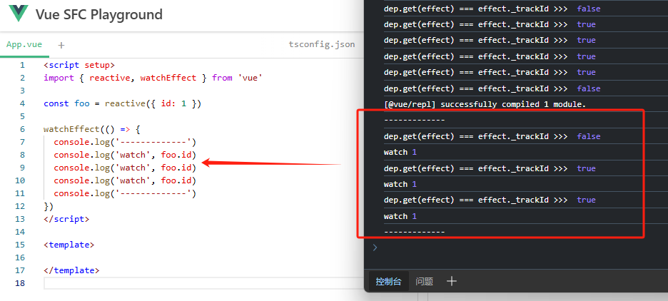

# Vue 源码解析之-Effect

::: tip 前言
由于本人写作水平有限，如果在阅读本文遇到暂时不理解的地方，可以先往下看，然后再回头理解。

effect 的概念需要与之前的模块进行交叉理解，有些知识比较绕，并且某些概念不在 `packages/reactivity` 这个包的范围内，因此不会展开介绍。

effect 涉及的主要模块：effect.ts、dep.ts、ref.ts，reactiveEffect.ts。
:::

对于 **effect** 的概念，首先来看一下官方文档的例子以及定义：

```js
let A2
function update() {
  A2 = A0 + A1
}
```

> - 这个 update() 函数会产生一个**副作用**，或者就简称为**作用 (effect)**，因为它会更改程序里的状态。
> - A0 和 A1 被视为这个作用的**依赖 (dependency)**，因为它们的值被用来执行这个作用。因此这次作用也可以被称作它的依赖的一个**订阅者 (subscriber)**。

vue 的响应式系统的概念，感觉像是观察者模式和发布-订阅模式的结合，上述例子中：`A0` 和 `A1` 就可以看作是一个被观察对象 observed (依赖)，当其发生变化就通知其订阅者 update (作用) 函数重新执行。

## effect：作用

作用的实体概念是通过 `ReactiveEffect` 类构建的，其简化的源码如下：

```ts
export class ReactiveEffect<T = any> {
  // ✨实例化的时候，默认处于活跃状态
  active = true

  // ✨effect的依赖集合，每个dep也保存着该effect，因此这个数组其实存在循环引用
  deps: Dep[] = []

  // ✨计算属性同时作为一个作用和依赖，绑定这个计算属性方便访问
  computed?: ComputedRefImpl<T>
  allowRecurse?: boolean

  // ✨effect清除回调
  onStop?: () => void

  // only dev 开发环境下的调试钩子
  onTrack?: (event: DebuggerEvent) => void
  onTrigger?: (event: DebuggerEvent) => void

  // ✨脏检查，控制effect的调度时机，默认为最高级
  _dirtyLevel = DirtyLevels.Dirty

  // ✨每次执行effect.run/effect.stop后，此Id会自增+1
  _trackId = 0

  // ✨当前effect正在执行的次数
  _runnings = 0

  // ✨是否应该调度
  _shouldSchedule = false

  // ✨依赖集合的长度，同时也是收集依赖时的对应依赖的位置指针
  _depsLength = 0

  constructor(
    public fn: () => T,
    public trigger: () => void,
    public scheduler?: EffectScheduler,
    scope?: EffectScope
  ) {
    // ✨收集当前effect的作用域
    recordEffectScope(this, scope)
  }

  public get dirty() {
    // ...
    return this._dirtyLevel >= DirtyLevels.Dirty
  }

  public set dirty(v) {
    this._dirtyLevel = v ? DirtyLevels.Dirty : DirtyLevels.NotDirty
  }

  // 运行effect
  run() {
    // ...
  }

  // 停用effect
  stop() {
    // ...
  }
}
```

在这里只需简单了解 `ReactiveEffect` 类提供了哪些属性和方法，关于详细的解释，将在下文逐步进行说明。

## dep: 依赖

依赖的实体概念是通过 `createDep` 函数创建的，其源码如下：

```ts
export type Dep = Map<ReactiveEffect, number> & {
  cleanup: () => void
  computed?: ComputedRefImpl<any>
}

export const createDep = (
  cleanup: () => void,
  computed?: ComputedRefImpl<any>
): Dep => {
  const dep = new Map() as Dep // effect Map集合
  dep.cleanup = cleanup // dep被清除时的回调
  dep.computed = computed // 如果dep是一个计算属性，则绑定这个computed
  return dep
}
```

依赖的构造十分简单，从其类型定义中可以看到，`Dep` 就是一个存储了该依赖的订阅者 (effects) 的 `Map` 集合，其 `key` 为 `ReactiveEffect` 实例，`value` 为 `effect._trackId`，同时该集合还有 `cleanup` 和 `computed` 这两个额外属性。

当我们了解 `effect` 和 `dep` 的构造后，就可以开始分析 `track` 和 `trigger` 了。

## track: 追踪依赖

在了解 `effect` 和 `dep` 的结构后，我们知道 `effect` 有个 `deps` 属性会保存依赖，而一个 `dep` 则是其所有订阅者 **effects** 的 `Map` 集合。由于 `effect` 和 `dep` 是多对多的关系，因此需要这样的双边信息存储，才能够在**依赖更新**的时候触发其所有**订阅的作用**，同时在**清除某个作用**的时候，又能够快速找到该作用所有的依赖对应的这个 `effect`，取消其订阅。

### 操作类型

首先，给出 track 的操作类型 `TrackOpTypes` 定义如下：

```ts
export enum TrackOpTypes {
  GET = 'get',
  HAS = 'has',
  ITERATE = 'iterate'
}
```

::: tip
触发 `TrackOpTypes.ITERATE` 的操作有 ownKeys 代理、集合的.size 访问、集合的.forEach 方法，以及涉及到集合的迭代器的方法：keys，values，entries，forof 循环以及数组/集合解构。
:::

### trackEffect

track 操作的底层接口来自于 `trackEffect` 函数, 其作用就是对传入 `effect` 和 `dep` 参数进行双边的信息跟踪存储。

```ts
export function trackEffect(
  effect: ReactiveEffect,
  dep: Dep,
  debuggerEventExtraInfo?: DebuggerEventExtraInfo
) {
  // ✨过滤重复的依赖，涵盖了初始化的情况
  if (dep.get(effect) !== effect._trackId) {
    // ✨更新dep的effect集合
    dep.set(effect, effect._trackId)

    // ✨如果暂时不明白下面的更新逻辑，可以等看完 effect.run 部分再回来理解✨

    // ✨_depsLength 指针指向了当前 dep 在 effect.deps 中的位置
    // ✨更直白的说：_depsLength 的当前值表示这个依赖在 effect 中是第几个访问的
    const oldDep = effect.deps[effect._depsLength]
    if (oldDep !== dep) {
      // ✨ oldDep !== dep 说明 effect 中的依赖顺序发生了变化
      // ✨通常是由于if等流程控制语句改变导致
      if (oldDep) {
        // ✨如果该位置存在旧的依赖，并且这个依赖的位置与当前的依赖冲突，则清除
        cleanupDepEffect(oldDep, effect)
      }
      // ✨将该依赖放置正确的位置
      effect.deps[effect._depsLength++] = dep
    } else {
      // ✨如果 effect 重新运行后，该依赖的访问位置没有发生变化，则复用，指针+1即可
      effect._depsLength++
    }
    if (__DEV__) {
      effect.onTrack?.(extend({ effect }, debuggerEventExtraInfo!))
    }
  }
}
```

`trackEffect` 不会对重复的依赖进行追踪，其第一个 if 语句会过滤掉在当前活跃副作用中重复的依赖，`dep.get(effect) === effect._trackId` 的情况如下图所示：



可以看到，在 `watchEffect` 中第二次和第三次调用 `foo.id`，是不会重复执行 `trackEffect` 内的逻辑了。

### ref

对于 `ref` 响应式函数的 track 处理，其调用入口为 `trackRefValue`，位于 `ref.ts` 模块，相应的源码如下：

```ts
export function trackRefValue(ref: RefBase<any>) {
  if (shouldTrack && activeEffect) {
    // ✨兼容ref被readonly代理的情况
    ref = toRaw(ref)
    trackEffect(
      activeEffect,
      (ref.dep ??= createDep(
        () => (ref.dep = undefined),
        ref instanceof ComputedRefImpl ? ref : undefined
      )),
      __DEV__
        ? {
            target: ref,
            type: TrackOpTypes.GET,
            key: 'value'
          }
        : void 0
    )
  }
}
```

可以看到，`trackRefValue` 在 `trackEffect` 外部加了一层当前是否存在活跃的副作用以及是否应该 track 的判断。

同时我们也知道 `ref` 本质是一个对外暴露了 `.value` 属性的对象，因此也可以对其进行 `readonly` 代理，改变其 `.value` 属性为只读，这与 `readonly(reactive(target))` 的情况是一样的，因此需要对其进行 `toRaw(ref)` 转换。

并且，可以看到对于 `ref` 的 track 是只跟踪了其 `.value` 属性，如果 `.value` 的值是一个对象，那么对其的响应性跟踪则由 `reactive` 接管，见下文。

:::tip
对于 `ref` 而言，不需要像 `reactive` 那样将每个追踪的 key 都缓存在一个 `map` 中，因为只追踪了其 `.value` 一个属性，因而在 `ref` 类有一个 `dep` 属性用来保存 `.value` 这个依赖，方便访问。
:::

### reactive

对于 `reactive` 函数，即对象类型的 track 处理，其调用入口为 `track` 函数，位于 `reactiveEffect.ts` 模块，相应的源码如下：

```ts
export function track(target: object, type: TrackOpTypes, key: unknown) {
  if (shouldTrack && activeEffect) {
    // ✨获取目标对象追踪的属性集合
    let depsMap = targetMap.get(target)
    if (!depsMap) {
      // ✨depsMap初始化
      targetMap.set(target, (depsMap = new Map()))
    }

    // ✨获取指定属性的依赖集合
    let dep = depsMap.get(key)
    if (!dep) {
      // ✨key对应的dep集合初始化
      depsMap.set(key, (dep = createDep(() => depsMap!.delete(key))))
    }
    trackEffect(
      activeEffect,
      dep,
      __DEV__
        ? {
            target,
            type,
            key
          }
        : void 0
    )
  }
}
```

在 `reactiveEffect.ts` 模块定义了一个顶层变量 `targetMap` 用于存储每个对象追踪的 `key` 所对应的依赖集合，其类型结构定义如下：

```ts
type KeyToDepMap = Map<any, Dep>
const targetMap = new WeakMap<object, KeyToDepMap>()
```

不同于 `ref` 类型，由于 `reactive` 是惰性转换的，因此只需要追踪需要用到的 `key`，并创建相应的依赖即可。

## trigger: 触发作用

### 操作类型

首先，给出 trigger 的操作类型 `TriggerOpTypes` 定义如下：

```ts
export enum TriggerOpTypes {
  SET = 'set',
  ADD = 'add', // Add 不是特指set.add方法，而是指代一个属性是新添加的情况
  DELETE = 'delete',
  CLEAR = 'clear'
}
```

### 脏检查

在分析 trigger 之前，先了解一下 `effect` 中的 **“脏”** 问题。在 `ReactiveEffect` 类中有一个 `_dirtyLevel` 属性，初始化的时候被赋值为 `DirtyLevels.Dirty`，对于 `DirtyLevels` 这个枚举的定义如下：

```ts
export enum DirtyLevels {
  NotDirty = 0, // 表示数据没有发生变化，不需要重新渲染
  QueryingDirty = 1, // 表示正在查询是否脏，即正在进行脏检查的过程中
  MaybeDirty_ComputedSideEffect = 2, // 表示可能已经脏了，通常是由于计算属性的副作用导致
  MaybeDirty = 3, // 表示可能已经脏了，但是原因尚不明确
  Dirty = 4 // 表示数据已经发生变化，需要重新渲染
}
```

脏检查是一种用于检测数据是否已经发生变化从而判断需要重新渲染的机制，因此这些脏等级是与数据是否发生变化有关。目前，我们只需知道：当值为 `Dirty` 时，表示数据发生变化，需要进行相应的更新操作即可。

### triggerEffects

trigger 操作的底层接口是 `triggerEffects` 函数，其源码如下：

```ts
export function triggerEffects(
  dep: Dep,
  dirtyLevel: DirtyLevels,
  debuggerEventExtraInfo?: DebuggerEventExtraInfo
) {
  // ✨暂停调度
  pauseScheduling()

  // ✨遍历dep所有订阅的effect
  for (const effect of dep.keys()) {
    // dep.get(effect) is very expensive, we need to calculate it lazily and reuse the result
    // ✨上面的注释：
    // ✨前半句：expensive 的原因应该在于dep是一个Map结构，是底层的问题
    // ✨后半句：lazily and reuse 体现在下面的 tracking 赋值在条件的 `&&` 后面，同时由于 `??=` 运算符的特性，赋值操作只会执行一次
    // ✨tracking表示是否要跟踪当前的依赖关系
    let tracking: boolean | undefined
    if (
      effect._dirtyLevel < dirtyLevel &&
      (tracking ??= dep.get(effect) === effect._trackId)
    ) {
      // ✨结合 _dirtyLevel === DirtyLevels 和 _dirtyLevel < dirtyLevel
      // ✨表示依赖的数据发生了变化，因此将_shouldSchedule设置为true
      effect._shouldSchedule ||= effect._dirtyLevel === DirtyLevels.NotDirty
      effect._dirtyLevel = dirtyLevel
    }
    if (
      effect._shouldSchedule &&
      (tracking ??= dep.get(effect) === effect._trackId)
    ) {
      if (__DEV__) {
        effect.onTrigger?.(extend({ effect }, debuggerEventExtraInfo))
      }
      effect.trigger()

      // ✨runings表示当前effect正在运行的次数
      if (
        (!effect._runnings || effect.allowRecurse) &&
        effect._dirtyLevel !== DirtyLevels.MaybeDirty_ComputedSideEffect
      ) {
        // ✨在一个更新周期中effect只能调度一次
        effect._shouldSchedule = false
        if (effect.scheduler) {
          queueEffectSchedulers.push(effect.scheduler)
        }
      }
    }
  }

  // ✨恢复调度
  resetScheduling()
}
```

上面的注释写得不是很清楚，看了之后应该还是一头雾水，但是没关系，先接着往下看。

### ref

对于 `ref` 响应式函数的 trigger 处理，其调用入口为 `triggerRefValue`，位于 `ref.ts` 模块，相应的源码如下：

```ts
export function triggerRefValue(
  ref: RefBase<any>,
  dirtyLevel: DirtyLevels = DirtyLevels.Dirty,
  newVal?: any
) {
  // ✨兼容readonly(ref())代理的情况
  ref = toRaw(ref)
  const dep = ref.dep
  if (dep) {
    triggerEffects(
      dep,
      dirtyLevel,
      __DEV__
        ? {
            target: ref,
            type: TriggerOpTypes.SET,
            key: 'value',
            newValue: newVal
          }
        : void 0
    )
  }
}

class RefImpl<T> {
  // ...
  set value(newVal) {
    triggerRefValue(this, DirtyLevels.Dirty, newVal)
  }
}
```

### reactive

对于 `reactive` 响应式函数的 trigger 处理，其调用入口为 `trigger`，位于 `reactiveEffect.ts` 模块，由于 `trigger` 的逻辑有点多，因此将切割为 3 部分进行说明。

第 1 部分：

```ts
export function trigger(
  target: object,
  type: TriggerOpTypes,
  key?: unknown,
  newValue?: unknown,
  oldValue?: unknown,
  oldTarget?: Map<unknown, unknown> | Set<unknown>
) {
  // ✨获取目标对象追踪的属性集合
  const depsMap = targetMap.get(target)
  if (!depsMap) {
    // never been tracked
    return
  }
  // ✨应该触发更新的依赖集合
  let deps: (Dep | undefined)[] = []

  if (type === TriggerOpTypes.CLEAR) {
    // collection being cleared
    // trigger all effects for target
    // ✨调用MAP/Set的clear方法，依赖是集合所有的value，因此需要触发所有的effects
    deps = [...depsMap.values()]
  } else if (key === 'length' && isArray(target)) {
    // ✨如果数组的长度被修改了，依赖是length属性以及所有下标>=新长度的key
    const newLength = Number(newValue)
    depsMap.forEach((dep, key) => {
      if (key === 'length' || (!isSymbol(key) && key >= newLength)) {
        deps.push(dep)
      }
    })
  } else {
    // 第2部分
  }
  // 第3部分
}
```

第 2 部分：

```ts
export function trigger(
  target: object,
  type: TriggerOpTypes,
  key?: unknown,
  newValue?: unknown
) {
  const depsMap = targetMap.get(target)
  let deps: (Dep | undefined)[] = []

  if (type === TriggerOpTypes.CLEAR) {
    // 第1部分
  } else if (key === 'length' && isArray(target)) {
    // 第1部分
  } else {
    // schedule runs for SET | ADD | DELETE
    // ✨对象的属性赋值操作
    // ❗注意：不包括直接在Map/Set实例上添加自定义属性
    if (key !== void 0) {
      deps.push(depsMap.get(key))
    }

    // also run for iteration key on ADD | DELETE | Map.SET
    switch (type) {
      case TriggerOpTypes.ADD:
        // ✨对于 ADD 操作，依赖为与对象长度有关的key
        // ❗ADD 操作不是特指 set.add，而是指代某个属性是新添加的情况
        // ✨具体为：数组的length属性，集合的迭代器ITERATE_KEY
        // ✨特别的：如果是Map对象还有一个MAP_KEY_ITERATE_KEY
        if (!isArray(target)) {
          deps.push(depsMap.get(ITERATE_KEY))
          if (isMap(target)) {
            deps.push(depsMap.get(MAP_KEY_ITERATE_KEY))
          }
        } else if (isIntegerKey(key)) {
          // new index added to array -> length changes
          deps.push(depsMap.get('length'))
        }
        break
      case TriggerOpTypes.DELETE:
        // ✨对于 DELETE 操作，这个操作是Map/Set独有的，依赖为ITERATE_KEY
        // ✨特别的：如果是Map对象还有一个MAP_KEY_ITERATE_KEY
        if (!isArray(target)) {
          deps.push(depsMap.get(ITERATE_KEY))
          if (isMap(target)) {
            deps.push(depsMap.get(MAP_KEY_ITERATE_KEY))
          }
        }
        break
      case TriggerOpTypes.SET:
        // ✨ SET 操作为Map对象独有的
        if (isMap(target)) {
          deps.push(depsMap.get(ITERATE_KEY))
        }
        break
    }
  }
  // 第3部分
}
```

第 3 部分：

```ts
export function trigger(
  target: object,
  type: TriggerOpTypes,
  key?: unknown,
  newValue?: unknown,
  oldValue?: unknown,
  oldTarget?: Map<unknown, unknown> | Set<unknown>
) {
  // ✨获取目标对象追踪的属性集合
  const depsMap = targetMap.get(target)
  // ✨应该触发更新的依赖集合
  let deps: (Dep | undefined)[] = []

  // 第1/2部分

  // ✨暂停调度
  pauseScheduling()
  // ✨遍历前两部分收集的所有依赖，触发其相应的effects
  for (const dep of deps) {
    if (dep) {
      triggerEffects(
        dep,
        DirtyLevels.Dirty,
        __DEV__
          ? {
              target,
              type,
              key,
              newValue,
              oldValue,
              oldTarget
            }
          : void 0
      )
    }
  }
  // ✨恢复调度
  resetScheduling()
}
```

### 额外细节

首先，对于 `ref` 和 `reactive` 的 trigger 操作，可以看到，传入的 `dirtyLevel` 参数都是 `DirtyLevels.Dirty`，根据脏检查的概念，也就是说，所有的 trigger 操作都视为是数据发生了变化。

其次，在 `triggerEffects` 这个底层 API 中，我们并没有看到实际运行 effect 的相关代码，其中只涉及到了调度的操作，然而，调度并不是真正的触发数据更新的行为。出于性能考量，vue 采用批处理的方式进行数据更新和渲染，诚如官网所说：

> 类似于组件更新，用户创建的侦听器回调函数也会被批量处理以避免重复调用。

因此实际的数据更新逻辑并不在 `triggerEffects` 这个函数中，不过对于调度相关的代码将在接下来进行说明。

## effect 的调度

在分析 `effect` 的调度问题前，还有一个坑需要填下。在文章开头部分给出了 `ReactiveEffect` 类的简化代码，其中省略了 `.run` 和 `.stop` 方法，因此先对这两个方法进行说明。

### effect.run

我们先来看看 `.run` 方法做了什么。

```ts
// ✨effect.ts 模块的顶层变量
export let activeEffect: ReactiveEffect | undefined
export let shouldTrack = true

class ReactiveEffect<T = any> {
  // ...

  run() {
    // ✨更新dirtyLevel
    this._dirtyLevel = DirtyLevels.NotDirty
    // ✨如果当前effect不是活跃的，直接返回effect结果，不会触发相关的状态更新
    if (!this.active) {
      return this.fn()
    }

    // ✨保存上一次活跃的effect状态
    let lastShouldTrack = shouldTrack
    let lastEffect = activeEffect
    try {
      // ✨设置当前effect为活跃的副作用，并进行runnings计数
      shouldTrack = true
      activeEffect = this
      this._runnings++

      // ✨预清除effect(标记阶段)
      preCleanupEffect(this)
      return this.fn()
    } finally {
      // ✨清除effect(执行阶段)，并恢复之前的状态
      postCleanupEffect(this)
      this._runnings--
      activeEffect = lastEffect
      shouldTrack = lastShouldTrack
    }
  }
}

function preCleanupEffect(effect: ReactiveEffect) {
  // ✨更新追踪的effect标识，同时标记清除所有旧的依赖
  effect._trackId++
  effect._depsLength = 0
}

function postCleanupEffect(effect: ReactiveEffect) {
  // ✨_depsLength !== 0，表明在effect.run的过程中，产生了新的依赖
  if (effect.deps.length > effect._depsLength) {
    // ✨清除旧的依赖
    // ✨effect.deps.length是旧依赖集合的长度
    // ✨effect._depsLength是新依赖集合的长度
    for (let i = effect._depsLength; i < effect.deps.length; i++) {
      cleanupDepEffect(effect.deps[i], effect)
    }
    // ✨更新当前依赖集合的长度
    effect.deps.length = effect._depsLength
  }
}

function cleanupDepEffect(dep: Dep, effect: ReactiveEffect) {
  const trackId = dep.get(effect)
  if (trackId !== undefined && effect._trackId !== trackId) {
    dep.delete(effect)
    if (dep.size === 0) {
      dep.cleanup()
    }
  }
}
```

首先，`run` 方法更新了 `_dirtyLevel` 属性为 `notDirty`，结合前文 `triggerEffects` 函数中的过滤，这表明在当前更新周期中，接下来不会再次对此 effect 进行调度。接着是将该 effect 赋值为顶层变量 `activeEffect`，设置当前作用为正在活跃的副作用，同时保存之前活跃的作用状态，然后准备执行当前副作用。

接着执行到 `this._runnings++`，`runings` 表示当前作用正在被执行的次数，这个计数的实际用途，在这个模块中没找到，猜测是因为后面 `this.fn()` 的执行也许会再次调用该作用，因此需要进行计数，以便于进行相关的优化。

然后进行 `preCleanupEffect` 预清理，预清理过程会将 `_trackId + 1`，同时设置 `_depsLength = 0`，这表明会将所有当前依赖清空，但是还未开始执行，然后等到 `this.fn()` 执行完后，再进行 `postCleanupEffect`，正式清除旧依赖，并且收集新产生的依赖。

最后恢复之前的作用状态，`run` 运行结束。

下面以举个栗子来分析上述代码的运行过程：

```ts
const proxy = reactive({ one: 1, two: 2, three: 3 })

// ✨首次运行，依赖只有 one 和 two 属性
watchEffect(() => {
  if (proxy.one === 1) {
    console.log(proxy.two)
  } else {
    console.log(proxy.three)
  }
})

proxy.three = 300 // 不会触发watchEffect，因为three不是依赖
proxy.two = 200 // 触发watchEffect
proxy.one = 100 // watchEffect的依赖变为one和three，清除了two依赖
```

在上面的例子中，`watchEffect` 首次运行只有 `one` 和 `two` 两个依赖，为什么没有 `three`？因为压根就没有触发 `three` 属性的 `get` 或者任何其他的取值拦截操作。当修改 `one` 的值后，作用重新运行`(执行this.fn)`，此时由于内部的流程控制更改，导致没有触发 `two` 的 `get`，而触发了 `three` 的 `get`，因此作用重新运行后，相应的依赖也发生了变化。

通过上述例子可以得知：**一个副作用是不确定的，每次运行后产生的依赖也会有所不同**。

由于 `this.fn()` 每次运行可能产生不确定的变动，因此 `effect` 就需要重新对依赖进行收集，其运行放置在一个 `try` 语块中，当其出错，就清空所有依赖，释放空间。同时，还有一个细节就是：`postCleanupEffect` 中，从 `dep` 身上清除 `effect` 是使用 `delete` 操作，而从 `effect` 中清除 `dep` 则是直接通过下标覆盖取代，这是因为 `effect.deps` 是一个数组，而对一个数组进行删除和插入是很消耗性能的行为，因此通过设置一个额外的 `_depsLength` 指针，不仅规避了这个问题，还实现了复用。

到此，我想你应该理解了为什么需要在每次作用运行后，都要清除旧的依赖，以及 `preCleanupEffect` 和 `postCleanupEffect` 方法的作用。现在你可以回头再次阅读 [trackEffect](#trackeffect) 的源码，此时，你应该可以明白 `_depsLength` 指针的巧妙之处，以及为什么移除依赖要分 `preCleanupEffect` 和 `postCleanupEffect` 这两个阶段了。

最后在该模块还有一段涉及到 `Track` 的代码，如下所示：

```ts
export let shouldTrack = true
const trackStack: boolean[] = []

export function pauseTracking() {
  trackStack.push(shouldTrack)
  shouldTrack = false
}

// ❗已废弃
export function enableTracking() {
  trackStack.push(shouldTrack)
  shouldTrack = true
}

// 取代了 enableTracking
export function resetTracking() {
  const last = trackStack.pop()
  shouldTrack = last === undefined ? true : last
}
```

从 `trackStack` 这个变量的命名其实已经可以知道上述代码的作用了，就是处理嵌套的 `effect` 作用域问题。

为什么在 `run` 中需要保存相关上下文的信息，就是因为作用本身是存在嵌套使用的，这很好理解，因为 `vue 组件实例` 本身就是绑定了一个 `effect`，而我们在组件中又可以使用 `computed, watch, watchEffect` 这些能产生 `effect` 的函数，并且 vue 还提供了底层的 API，如 `effectScope` 来让开发者更灵活的控制 `effect` 的作用域。

### effect.stop

对于 `effect.stop` 方法，已经没什么好分析的，其源码如下：

```ts
class ReactiveEffect<T = any> {
  // ...

  stop() {
    if (this.active) {
      preCleanupEffect(this)
      postCleanupEffect(this)
      this.onStop && this.onStop()
      this.active = false
    }
  }
}
```

### scheduling

该模块中关于 `effect` 的调度操作只有如下几行代码：

```ts
export let pauseScheduleStack = 0

export function pauseScheduling() {
  pauseScheduleStack++
}

export function resetScheduling() {
  pauseScheduleStack--
  while (!pauseScheduleStack && queueEffectSchedulers.length) {
    queueEffectSchedulers.shift()!()
  }
}
```

对于调度，需要关注的一点就是：如何通过调度优化，来减少 effect 的重复触发次数，进而实现批量更新。

在上文中的 `triggerEffects` 和 `trigger` 源码中，我们注意到在进行依赖和作用的遍历操作时，其外层都包含了一对 `pauseScheduling` 和 `resetScheduling` 调用，其目的就是等一个作用的所有依赖的更新都结束了，再将该作用推入一个任务队列。

其实，这个模块的调度并不是 vue 批处理的关键，其核心逻辑在别的包，不在 `reactivity` 这个包中，由于我还没阅读到，这里也就不打算展开了，就以 `watchEffect` 函数为例，看看这个模块中的调度做了什么吧。

首先，在 `watchEffect` 运行的时候，会创建一个 `ReactiveEffect` 实例，并且传入 `scheduler` 调度器参数，其代码如下：

```ts
scheduler = () => queueJob(job)
const effect = new ReactiveEffect(getter, NOOP, scheduler)
```

我们知道当 `trigger` 的时候，`effect.scheduler` 会被推入到 `queueEffectSchedulers` 队列中并执行，结合上面的 `resetScheduling` 方法，也就是执行 `queueJob(job)` 这个函数了，而这个 `job` 对象则是一个通过闭包绑定了一个 `effect` 的任务函数，并在其调用时，执行 `effect.run()`，至于 `queueJob` 函数的细节和调用，以目前的知识就无法继续说明了，对于本模块的调度操作也就到此为止了。

## 结语

终于是写完关于 effect 模块的内容了，这部分的内容有点多，而且还有点绕，看了好几遍才想明白。当结束这篇文章后，关于 vue 的响应式系统源码，也就是 `reactivity` 这个包的内容也就差不多要结束了，就只剩下了 `computed` 和 `effectScope` 这两个模块。
