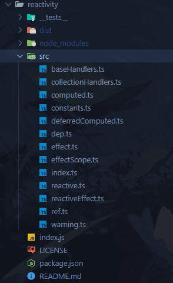

# Vue 源码解析之-EffectScope

## 摘要

`EffectScope` 是一个偏底层的 API，先来看下它的使用，以下示例来自于该 API 的 [RFC](https://github.com/vuejs/rfcs/blob/master/active-rfcs/0041-reactivity-effect-scope.md)。

```js
const scope = effectScope()

scope.run(() => {
  const doubled = computed(() => counter.value * 2)

  watch(doubled, () => console.log(doubled.value))

  watchEffect(() => console.log('Count: ', doubled.value))
})

// 处理掉当前作用域内的所有 effect
scope.stop()
```

可以看到 `effectScope()` 创建了一个作用域，这个作用域可以通过 `.run` 方法，来收集回调中的所有 `effects`，并进行处理。

## 动机

根据文档的描述，在 vue 组件的 `setup()` 中，会自动创建一个 `effect` 作用域， 收集当前组件的所有 `effect`，并绑定到当前组件实例上，当组件卸载时，就一并清除收集到的所有 `effect`。正常情况下，`vue 组件` 会自动帮我们管理 `effect`，但是有些情况下，这种自动管理会出问题。

比如，我们可以在一个组合式函数中创建一些 `effects`，如果这个组合式函数在组件中不是同步调用，那么可能就会出现组件无法追踪到这个组合式函数产生的作用。或者说这个组合式函数干脆都不是在组件中调用的，这时失去了组件的自动管理机制，就需要开发者手动管理了。糟糕的是当这个组合式函数内部的逻辑冗长且复杂的时候，开发者可能无法及时处理每个产生的副作用(可以手动停止 watch, watchEffect，computed 不行)，最后多次调用导致内存泄露。

可见，某些情况下我们真的需要能对某个范围内的 `effects` 进行手动管理的手段，因此，vue 设计了这个 API 并开放给开发者使用。

对于该 API 的具体使用，请参见 [RFC](https://github.com/vuejs/rfcs/blob/master/active-rfcs/0041-reactivity-effect-scope.md)。下面来看看这个 API 的实现。

## 源码

### EffectScope

```ts
export function effectScope(detached?: boolean) {
  // ✨detached 为true表示开启分离模式，当前作用域不会被父作用域捕捉
  return new EffectScope(detached)
}

// ✨顶层变量
let activeEffectScope: EffectScope | undefined

export class EffectScope {
  // ✨实例化后默认激活
  private _active = true

  // ✨当前作用域下的effects
  effects: ReactiveEffect[] = []

  // ✨清除回调集合
  cleanups: (() => void)[] = []

  // ✨父作用域
  parent: EffectScope | undefined

  // ✨子作用域
  scopes: EffectScope[] | undefined

  // ✨当前作用域在父作用域中的位置
  private index: number | undefined

  constructor(public detached = false) {
    // ✨保存父作用域
    this.parent = activeEffectScope
    if (!detached && activeEffectScope) {
      // ✨非分离模式绑定到父作用域下
      this.index =
        (activeEffectScope.scopes || (activeEffectScope.scopes = [])).push(
          this
        ) - 1
    }
  }

  get active() {
    return this._active
  }

  // ✨收集effect
  run<T>(fn: () => T): T | undefined {
    if (this._active) {
      // ✨设置当前作用域为活跃的，然后收集effects，最后还原上下文
      const currentEffectScope = activeEffectScope
      try {
        activeEffectScope = this
        return fn()
      } finally {
        activeEffectScope = currentEffectScope
      }
    } else if (__DEV__) {
      warn(`cannot run an inactive effect scope.`)
    }
  }

  // ✨激活
  on() {
    activeEffectScope = this
  }

  // ✨关闭
  off() {
    activeEffectScope = this.parent
  }

  stop(fromParent?: boolean) {
    if (this._active) {
      // ✨停用当前作用域，清除当前作用域与子作用域的effects
      let i, l
      for (i = 0, l = this.effects.length; i < l; i++) {
        this.effects[i].stop()
      }
      for (i = 0, l = this.cleanups.length; i < l; i++) {
        this.cleanups[i]()
      }
      if (this.scopes) {
        for (i = 0, l = this.scopes.length; i < l; i++) {
          this.scopes[i].stop(true)
        }
      }
      // nested scope, dereference from parent to avoid memory leaks
      // ✨从父作用域中删除
      if (!this.detached && this.parent && !fromParent) {
        // optimized O(1) removal
        const last = this.parent.scopes!.pop()
        if (last && last !== this) {
          this.parent.scopes![this.index!] = last
          last.index = this.index!
        }
      }
      this.parent = undefined
      this._active = false
    }
  }
}
```

### 工具

```ts
// ✨返回当前活跃的作用域
export function getCurrentScope() {
  return activeEffectScope
}

// ✨类似组件的 onUnmounted 钩子，为当前作用域注册清除回调
export function onScopeDispose(fn: () => void) {
  if (activeEffectScope) {
    activeEffectScope.cleanups.push(fn)
  } else if (__DEV__) {
    warn(
      `onScopeDispose() is called when there is no active effect scope` +
        ` to be associated with.`
    )
  }
}

// ✨将 effect 保存至作用域中
export function recordEffectScope(
  effect: ReactiveEffect,
  scope: EffectScope | undefined = activeEffectScope
) {
  if (scope && scope.active) {
    scope.effects.push(effect)
  }
}
```

`EffectScope` 的源码比较简单，没有什么特别的操作，就是通过 `run` 方法收集当前及子级作用域的 `effects`，然后通过 `stop` 方法进行清除即可。

这里关于 `recordEffectScope` 方法稍微提一下。在之前的 effect 文章中，关于 `ReactiveEffect` 的构造器有如下代码：

```ts
constructor(
    public fn: () => T,
    public trigger: () => void,
    public scheduler?: EffectScheduler,
    scope?: EffectScope,
  ) {
    recordEffectScope(this, scope)
  }
```

当初没有解释，现在举个例子：当在一个组件中使用 `watch/watchEffect/computed` 的时候，就会创建一个 `ReactiveEffect` 实例，然后呢，由于组件本身会生成一个 effect 作用域，因此 `watch/watchEffect/computed` 创建的 `effect` 就被捕捉了，然后等组件卸载的时候，这些侦听器，计算属性也就一并清除了。

## 结语

介绍完 `effectScope` 内容后，vue 的响应式系统源码，也就是 `reactivity` 这个包的内容就讲完了，可能还有一些边边角角的东西没有介绍，不过无伤大雅，不影响整体的理解。



至此，这个系列的文章总算是结束了，写了好几天，终于可以休息下了。
