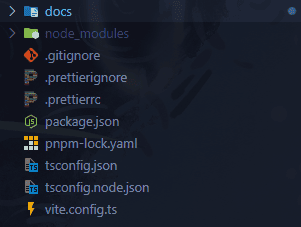
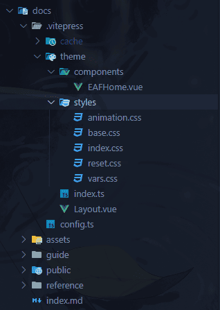
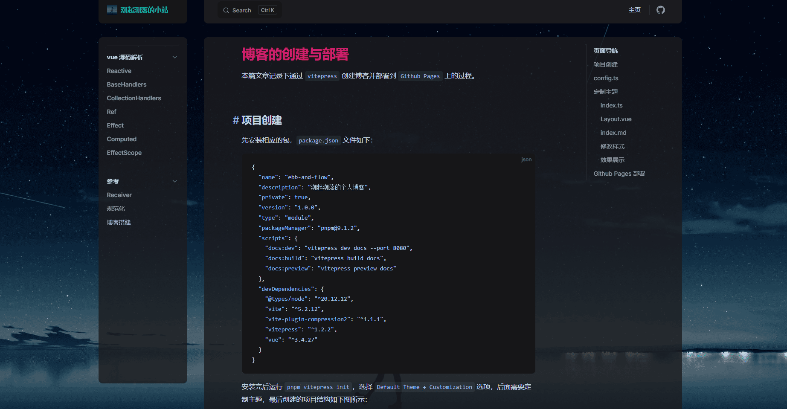

# 博客的创建与部署

本篇文章记录下通过 `vitepress` 创建博客并部署到 `Github Pages` 上的过程。

## 项目创建

先安装相应的包，`package.json` 文件如下：

```json
{
  "name": "ebb-and-flow",
  "description": "潮起潮落的个人博客",
  "private": true,
  "version": "1.0.0",
  "type": "module",
  "packageManager": "pnpm@9.1.2",
  "scripts": {
    "docs:dev": "vitepress dev docs --port 8080",
    "docs:build": "vitepress build docs",
    "docs:preview": "vitepress preview docs"
  },
  "devDependencies": {
    "@types/node": "^20.12.12",
    "vite": "^5.2.12",
    "vite-plugin-compression2": "^1.1.1",
    "vitepress": "^1.2.2",
    "vue": "^3.4.27"
  }
}
```

安装完后运行 `pnpm vitepress init`，选择 `Default Theme + Customization` 选项，后面需要定制主题，最后创建的项目结构如下图所示：



## config.ts

接着配置 `config.ts` 文件如下：

```ts
import { defineConfig } from 'vitepress'

// https://vitepress.dev/reference/site-config
const webBase = '/ebb-and-flow/'
export default defineConfig({
  title: '潮起潮落的小站', // 站点标题
  titleTemplate: '潮起潮落', // 站点标题后缀，与title一样，貌似会失效
  description: '潮起潮落的个人博客', // 站点描述
  lang: 'zh-cn', // 中文
  base: webBase, // 部署用，见后面 GitHub Pages 部署
  cleanUrls: true, // 开启简洁链接
  lastUpdated: true, // 开启文章更新时间

  // ✨强制暗黑主题(定制主题需要)
  appearance: 'force-dark',

  // ✨引入public中的站点图标
  head: [['link', { rel: 'icon', href: webBase + 'logo.png' }]],
  themeConfig: {
    logo: '/logo.png',
    nav: [{ text: '主页', link: '/' }],
    sidebar: [
      {
        text: '解析',
        collapsed: false, // 开启折叠
        items: [
          // ...
        ]
      }
    ],
    socialLinks: [
      { icon: 'github', link: 'https://github.com/vuejs/vitepress' }
    ],

    // ✨文章的页面导航
    outline: {
      label: '页面导航',
      level: [2, 3]
    },

    // ✨使用本地搜索
    search: {
      provider: 'local'
    },

    // ✨汉化
    lastUpdated: {
      text: '最后更新于'
    },
    docFooter: {
      prev: '上一篇',
      next: '下一篇'
    },
    returnToTopLabel: '回到顶部',

    // ✨显示外部链接图标
    externalLinkIcon: true
  },

  // ✨vite.config，引入外部的vite配置文件
  vite: {
    configFile: 'vite.config.ts'
  }
})
```

::: details vite.config.ts
设置一下开启压缩。

```ts
import { compression } from 'vite-plugin-compression2'
import { defineConfig } from 'vite'
import { resolve } from 'node:path'

export default defineConfig(({ command, mode }) => {
  // path-alias
  const __dirname__ = resolve()
  const pathSrc = resolve(__dirname__, 'docs')
  const alias = {
    '@': pathSrc
  }

  return {
    base: './',
    resolve: { alias },
    plugins: [compression()]
  }
})
```

:::

## 定制主题

按照自己喜好，定制主页和部分样式。在 `docs/.vitepress/theme` 目录下创建对应文件如下图：



### index.ts

`index.ts` 为定制主题的入口文件，这个文件存在就表明开启自定义主题。

```ts
import type { Theme } from 'vitepress'
import DefaultTheme from 'vitepress/theme'
import customTheme from './Layout.vue'
import './styles/index.css'

export default {
  extends: DefaultTheme,
  Layout: customTheme
} satisfies Theme
```

### Layout.vue

`Layout.vue` 为自定义的布局组件，`EAFHome` 为定制的主页组件，`DefaultTheme.Layout` 为 `vitepress` 的默认主题。

```vue
<script setup lang="ts">
// ✨引入默认主题
import DefaultTheme from 'vitepress/theme'
// ✨引入定制主页
import EAFHome from './components/EAFHome.vue'
import { useData, useRoute } from 'vitepress'
import { computed } from 'vue'

defineOptions({ name: 'EAFLayout' })

const { frontmatter, site } = useData()
const route = useRoute()

// ✨如果是根路由(主页)，且在index.md开启了EAF-HOME，则使用定制主页
const isCustom = computed(() => {
  const isRoot = route.path === site.value.base
  const layoutValue = frontmatter.value.layout
  return isRoot && layoutValue === 'EAF-HOME'
})
</script>

<template>
  <EAFHome v-if="isCustom" />
  <DefaultTheme.Layout v-else />
</template>
```

### index.md

`index.md` 为主页入口，需要在这里进行一些配置。

```md
---
layout: EAF-HOME

cover:
  name: 潮起潮落
  tagline: 月亮你为何，沉默不语，独留我一人面对，潮起潮落...

entryLink: /guide/reactive

titleTemplate: false
---
```

### 修改样式

在 `vars.css` 中定义自定义的 `css` 变量，然后在 `reset.css` 中修改默认主题的样式。

```css
/* vars.css */
:root {
  --EAF-c-h1: #cf206f;
  --EAF-c-title: #11b6a8;
  --EAF-c-outline-link: #a8b1ff;
  --vp-c-text-1: #cfd8e0;
}

/* ... */

/* reset.css */
@media (width > 960px) {
  /* ... */
}
```

### 效果展示

最后定制的效果如下图：


<div style="text-align: center">主页效果</div>



<div style="text-align: center">内容效果</div>

## Github Pages 部署

### 创建仓库

在 `github` 上创建一个仓库，然后把代码推上去。
